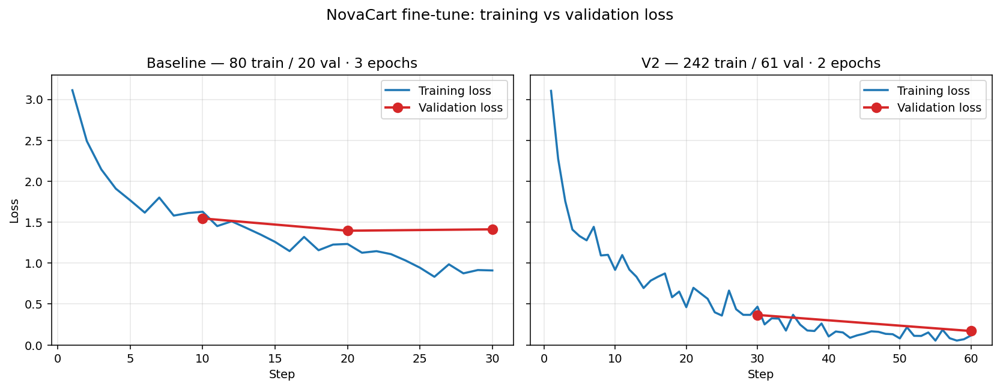

# NovaCart Fine-Tune Pipeline

> Fine-tuning Amazon Nova Micro on Bedrock to answer e-commerce support tickets — serverless pipeline + Angular chat UI.

I wanted to see how far a small, domain-specific dataset could push a foundation model. So I built NovaCart — a made-up e-commerce company — and taught Amazon Nova Micro to answer support tickets in its voice. The whole thing runs on AWS: drop a CSV in S3 and an hour later you get an email saying your custom model is ready to chat with.

## Architecture

The repo has two halves:

| Folder                                                      | What it is                                                                                                                                                                                                                          |
| ----------------------------------------------------------- | ----------------------------------------------------------------------------------------------------------------------------------------------------------------------------------------------------------------------------------- |
| **[`novacart-pkg/`](novacart-pkg/)** — the pipeline   | The serverless guts. S3 trigger → Lambda preps the data → Bedrock fine-tunes → EventBridge catches the completion → DynamoDB logs it → SNS emails you. See[`novacart-pkg/README.md`](novacart-pkg/README.md) for the deep dive. |
| **[`novacart-chat/`](novacart-chat/)** — the frontend | A tiny Angular 21 chat UI so you can actually talk to the model once it's deployed.                                                                                                                                                 |

## Did it work?

Mostly, yes — and the second pass was a huge jump over the first.

|                                             | First try | Second try (3× the data, 2 epochs) |
| ------------------------------------------- | --------: | ----------------------------------: |
| Training examples                           |        80 |                                 242 |
| Validation examples                         |        20 |                                  61 |
| Steps                                       |        30 |                                  60 |
| Best val_loss                               |      1.40 |                          **0.17** |
| Made up a "30-day return" policy?           |       yep |     no — says 7 days like it should |
| Invented a "15% goodwill refund"?           |       yep |                                gone |
| Closed every reply with the brand sign-off? |       8/8 |                                 8/8 |

What the curves show: the baseline's training loss kept dropping but validation barely moved — the model was memorising 80 examples, not generalising. The v2 run drops both training and validation together and lands at val_loss 0.17, the gap between train and val stays small, and there's no late-stage divergence (the classic overfitting tell). Raw CSVs are in [`novacart-pkg/metrics/`](novacart-pkg/metrics/) if you want to plot them yourself.

> A note on the x-axis: Bedrock logs one row every ~8 example passes, not one row per example. So 30 steps for baseline (80×3 ÷ 8) and 60 steps for v2 (242×2 ÷ 8) — the model still saw every single training example in both runs (verified against the input-manifest reports).

The val_loss drop looked almost too good, so I poked at it with real prompts the model hadn't seen. It held up — the hallucinations the baseline kept producing genuinely disappeared.

## Want to run it?

1. **Set up the AWS side** — [`novacart-pkg/docs/SETUP.md`](novacart-pkg/docs/SETUP.md) walks through the bucket, roles, Lambdas, and the EventBridge wiring.
2. **Train your own model** — drop [`sample-data/raw_tickets_500_clean.csv`](novacart-pkg/sample-data/raw_tickets_500_clean.csv) into `s3://<your-bucket>/raw/` and walk away. About an hour later you'll have a model.
3. **Try it out** — spin up an on-demand deployment in the Bedrock console, then point [`novacart-pkg/src/local/test_model.py`](novacart-pkg/src/local/test_model.py) at it.
4. **Chat with it** — set `apiUrl` in [`novacart-chat/src/environments/environment.ts`](novacart-chat/src/environments/environment.ts), `ng serve`, and you're talking to your model.

## What I actually learned

This project taught me more about the *modelling* side than I expected going in. The full write-up is in [`novacart-pkg/docs/LESSONS_LEARNED.md`](novacart-pkg/docs/LESSONS_LEARNED.md), but the things that genuinely changed how I think about fine-tuning:

- **Style is not scope.** The model picked up NovaCart's tone beautifully — warm, numbered steps, the brand sign-off. But ask it "compare Python and Java" and it would happily answer, sign-off and all. Fine-tuning shapes *how* a model speaks; it does very little to constrain *what* it'll speak about. That guardrail has to live in the system prompt, not in the weights.
- **A low validation loss can fool you.** My second run hit 0.17, which looked suspiciously good. The reason wasn't that the model became brilliant — it was that my dataset had a lot of paraphrased near-duplicates, so the validation set was easy. Loss numbers measure how well the model fits your data, not how good your data is. The only honest test is a handful of prompts the model has never seen.
- **The system prompt has to match training, exactly.** The fine-tuned behaviour is conditioned on the system prompt it was trained with. Change a sentence, drop the sign-off line, and you can lose half the gains. Train and inference are a contract — you can't renegotiate one side after the fact.
- **More data beats more epochs (for small datasets).** Going from 80 → 242 training examples did vastly more than tweaking epochs ever did. With a tiny dataset, the model just memorises; with three times the data, it actually has to generalise. Quantity is the cheapest lever you have before you start fiddling with hyperparameters.
- **Hallucinations come from your data, not from "the model lying."** The baseline kept inventing a 30-day return window and a 15% goodwill refund — not because the model was creative, but because my early data was inconsistent on those exact points. Clean the contradictions out of the training set and the "hallucinations" disappear. The model is mostly a mirror.

## License

See [`novacart-pkg/LICENSE`](novacart-pkg/LICENSE).
