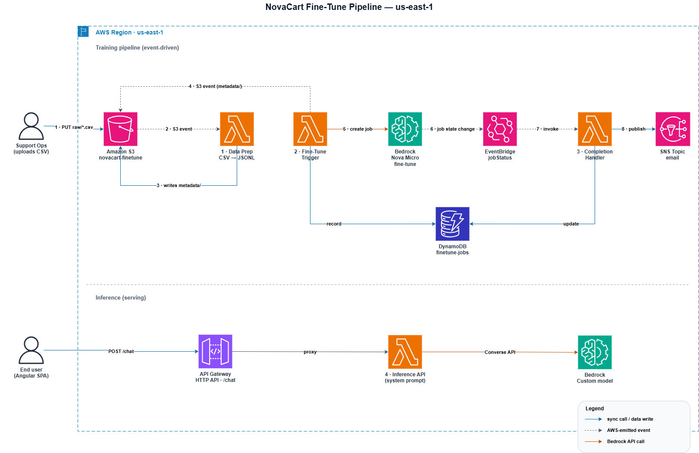

# The pipeline

The root [README](../README.md) covers what this project is and what I learned from it. This file is the deep dive into the AWS side — the four Lambdas, how they're wired together, why I made the choices I did, and what it actually costs to run.

If you want to deploy your own copy, the step-by-step is in [`docs/SETUP.md`](docs/SETUP.md). If you want the war stories, [`docs/LESSONS_LEARNED.md`](docs/LESSONS_LEARNED.md).

## How it's wired



Four Lambdas, glued together by S3 events and one EventBridge rule:

| # | Trigger | What it does |
|---|---------|--------------|
| 1 · Data Prep | S3 PUT on `raw/*.csv` | Validates the CSV, dedups, splits 80/20, converts to Bedrock Conversation JSONL |
| 2 · Fine-Tune Trigger | S3 PUT on `metadata/prep_summary.json` | Calls `bedrock.create_model_customization_job()`, records the job in DynamoDB |
| 3 · Completion Handler | EventBridge (`jobStatus` = Completed/Failed/Stopped) | Fetches the final metrics, updates DynamoDB, sends an SNS email |
| 4 · Inference API | API Gateway POST `/chat` | Calls the Converse API on the deployed custom model |

The thing that makes the training half work cleanly is **EventBridge**. Bedrock fine-tunes can take an hour or two; Lambda caps at 15 minutes. So instead of polling, I let Bedrock emit a state-change event when the job finishes and EventBridge invokes Lambda 3 the moment that happens. No polling loop, no babysitting.

## Why each piece is the way it is

**One Lambda per stage, not one big handler.** Each has its own IAM role (least-privilege), its own deploy, its own failure mode. When Lambda 2 throws because of a Bedrock throttle, that doesn't take down data prep. And when I'm reading a CloudWatch log group, I'm reading one stage's logs, not a 400-line spaghetti trace.

**Config through environment variables.** Bucket names, model IDs, hyperparameters — none of these are hard-coded. I learned this the hard way mid-project when the base model I was using got deprecated and I had to swap model IDs everywhere; would've been a five-minute change if it had been env vars from the start.

**Custom exceptions to control retry.** S3-triggered Lambdas auto-retry on raise. For a transient blip (Bedrock throttle, S3 hiccup) that's exactly what I want. For "this CSV is malformed" it's the opposite — retrying won't make the data valid. So I raise on transient failures and return on permanent ones. The full story of how I learned this is in `LESSONS_LEARNED.md`.

**EventBridge instead of polling.** A polling Lambda that checks "is the job done yet?" every five minutes would burn invocations for an hour straight and still be five minutes late. EventBridge fires the instant Bedrock emits the state change, and costs nothing while it's waiting.

**DynamoDB for the audit trail.** Every job — its hyperparameters, ARN, start/end times, final loss — gets a row. Lets me ask things like "which run had the lowest validation loss?" without re-reading the Bedrock console.

## Folder layout

```
novacart-pkg/
├── README.md                          # This file
├── architecture/
│   ├── architecture.drawio            # Editable source (open in draw.io)
│   └── architecture.png               # Exported diagram
├── src/
│   ├── lambdas/
│   │   ├── 1_data_prep.py             # CSV → JSONL + train/val split
│   │   ├── 2_finetune_trigger.py      # Starts the Bedrock job
│   │   ├── 3_completion_handler.py    # Closes the loop on job completion
│   │   └── 4_inference_api.py         # Serves the fine-tuned model
│   └── local/
│       └── test_model.py              # Quick CLI for poking at the deployed model
├── iam-policies/                      # Least-privilege role/policy JSON for each piece
├── sample-data/                       # CSVs you can drop in and train with
├── metrics/                           # Loss curves from the two training runs
└── docs/
    ├── SETUP.md                       # Deployment walk-through
    ├── LESSONS_LEARNED.md             # AWS war stories
    └── DATASET_FORMAT.md              # Bedrock Conversation format spec
```

## What it costs

The training compute is cheap. The cost that surprised me is **custom-model storage**, which bills daily for as long as the model exists in your account.

Actual numbers from my sandbox account (May 2026):

| Item | Cost |
|------|------|
| Lambda (all stages) | ~$2 per 1M invocations |
| Fine-tuning compute — baseline (80 ex × 3 epochs) | ~$0.02 |
| Fine-tuning compute — v2 (242 ex × 2 epochs) | ~$0.04 |
| **Custom-model storage** (Nova Micro) | **~$1.50 / day per model** |
| Custom-model inference — input tokens | ~$0.027 / 1M tokens |
| Custom-model inference — output tokens | ~$0.108 / 1M tokens |
| DynamoDB (on-demand) | Pennies/month |
| SNS email | Free tier covers it |

A typical chat exchange (~500 input + ~1k output tokens) lands around **$0.0001** — inference is effectively free at this scale.

> The storage line is the trap. A fine-tune run is well under a dollar, but every custom model you keep around bills ~$45/month just to sit there. Delete the ones you aren't actively using — in my sandbox, leftover models added up to $21 in May before I noticed.

## Prerequisites if you want to deploy this

- AWS account with Bedrock access in `us-east-1`
- Model access granted for Amazon Nova Micro
- Python 3.12

Then follow [`docs/SETUP.md`](docs/SETUP.md).

## License

See [`LICENSE`](LICENSE).
